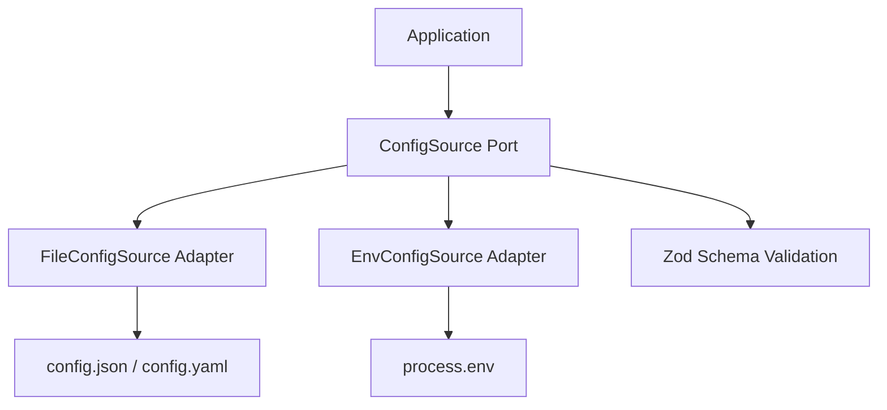

# Getting Started

## Installation

```bash
pnpm install
pnpm build
```

## Usage

```typescript
import { z } from 'zod'
import { FileConfigSource } from './src/adapters/FileConfigSource'
import { EnvConfigSource } from './src/adapters/EnvConfigSource'

const schema = z.object({
  port: z.number().default(3000),
  host: z.string().default('localhost'),
  debug: z.boolean().default(false),
})

const source = new FileConfigSource('./config.json')
const config = await source.load(schema)

console.log(config.port) // 3000
```

## Architecture



## Layout

| Path | Role |
|------|------|
| `src/domain/` | Config domain model |
| `src/ports/` | `ConfigSource` port |
| `src/adapters/` | File and environment adapters |

## Scripts

```bash
pnpm build      # Compile TypeScript
pnpm test       # Run Vitest tests
pnpm typecheck  # Type check without emit
```
